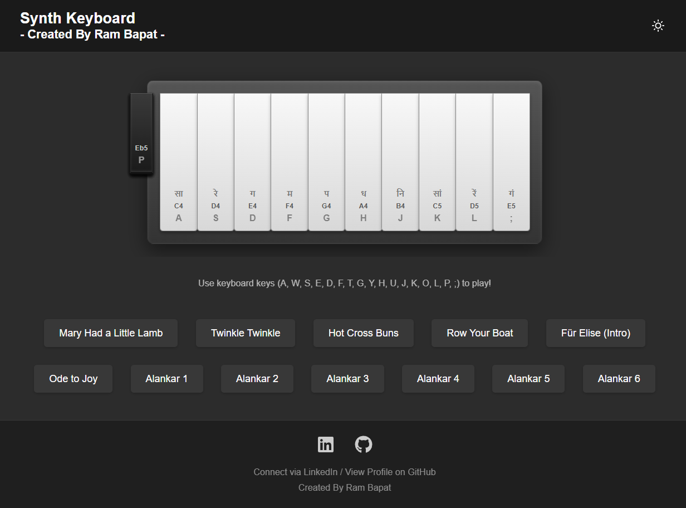
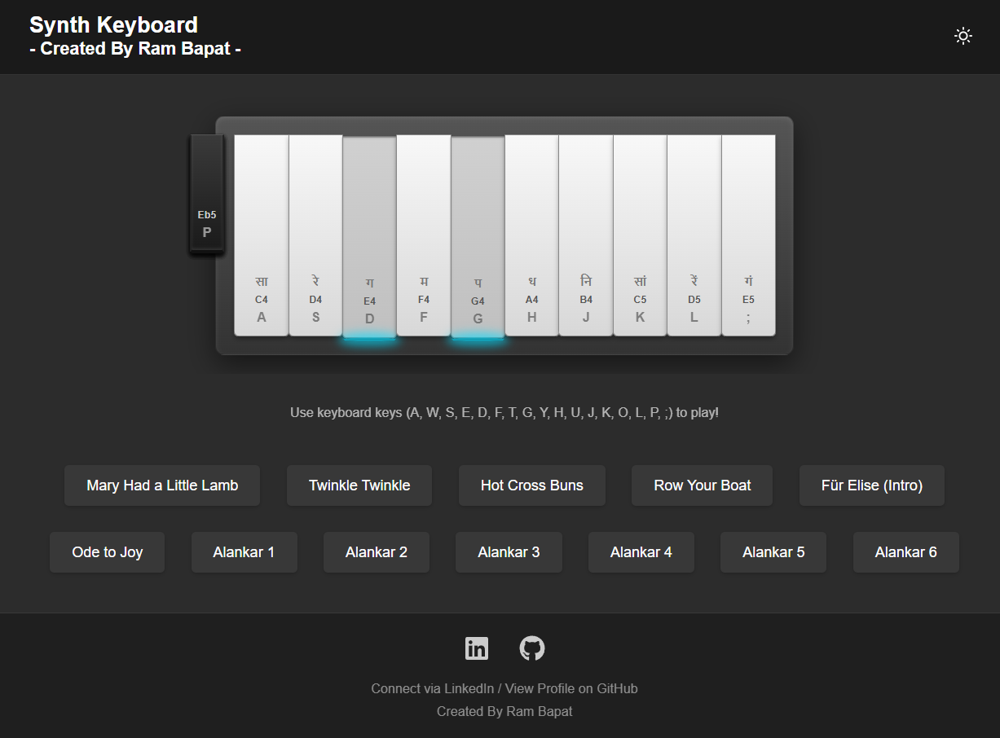
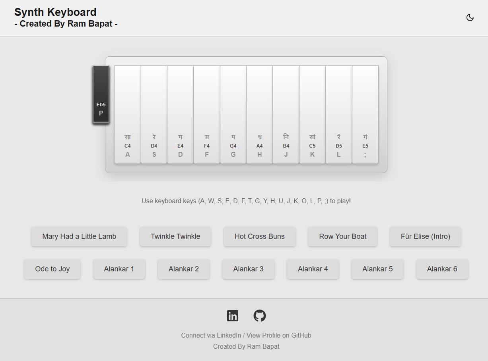

# Interactive Synth Keyboard 🎹🎵✨

## Try live demo - [[Demo](https://playable-react-synth-keyboard.vercel.app/)]


A visually stunning and interactive synthesizer keyboard application built with React, Vite, and Tone.js. Play notes using your mouse, touch screen, or computer keyboard, enjoy preset tunes, and switch between light and dark themes. This project was built as part of the #VibeCoding challenge, leveraging AI assistance throughout the development process.

<!-- ================================================== -->






<!-- ================================================== -->

## Overview

This project brings a playable synthesizer keyboard to the web with a modern and engaging interface. It features:

*   **Playable Interface:** Keys respond to mouse clicks, touch events, and computer keyboard input (standard QWERTY mapping provided).
*   **Audio Synthesis:** Uses Tone.js for generating polyphonic synth sounds with proper attack and release for sustained notes.
*   **Visual Feedback:** Keys animate and glow when pressed, providing satisfying visual feedback.
*   **Preset Tunes:** Includes buttons to automatically play various nursery rhymes, classical snippets, and Sargam (Alankar) patterns, with keys visually flashing along.
*   **Theming:** Offers a toggle switch for light and dark themes, with dark mode as the default.
*   **Indian Notation:** Displays Sargam notes (सा, रे, ग...) on the white keys alongside standard notation.
*   **Responsive Design:** Adapts to different screen sizes, including mobile and tablet views, with horizontal scrolling for the keyboard on smaller screens.

The goal was to create a functional and aesthetically pleasing musical instrument in the browser, exploring React, Tone.js, and modern CSS while embracing the iterative "Vibe Coding" approach with AI assistance.

## Features

*   **Multi-Input Playability:** Play using Mouse Down/Up, Touch Start/End, or Keyboard Key Down/Up.
*   **Sustained Notes:** Implements `triggerAttack`/`triggerRelease` for notes that sound as long as a key is held.
*   **Visual Key Animation:** Keys depress and glow on activation using CSS transforms and pseudo-elements.
*   **Polyphonic Synth:** Powered by `Tone.PolySynth` for playing multiple notes simultaneously.
*   **Preset Tunes & Sargam:** Includes various melodies and Alankar patterns that auto-play with visual key flashing.
*   **Theme Toggle:** Smoothly transitions between a dark (default) and light UI theme using CSS variables.
*   **Notation Display:** Shows standard note names (C4, Db4...), computer key bindings (A, W, S...), and Sargam notation (on white keys).
*   **Responsive Layout:** Designed to work well across desktop, tablet, and mobile devices.
*   **Modern Tech Stack:** Built with React, Vite, Tone.js, and modern CSS.
*   **Iconography:** Uses `react-icons` for theme toggle and footer icons.

## Tech Stack

*   **Frontend:** React 18+
*   **Build Tool:** Vite
*   **Audio:** Tone.js
*   **Styling:** CSS3 (Flexbox, Grid, Custom Properties/Variables, Gradients, Shadows, Transitions)
*   **Language:** JavaScript (ES6+)
*   **Icons:** `react-icons`
*   **Package Manager:** npm

## Getting Started

To get a local copy up and running, follow these simple steps.

### Prerequisites

*   Node.js (v18+ recommended, includes npm) installed on your system. You can download it from [nodejs.org](https://nodejs.org/).
*   Git (for cloning the repository).

### Installation & Setup

1.  **Clone the repository:**
    ```bash
    git clone https://github.com/Barrsum/playable-react-synth-keyboard.git
    ```

2.  **Navigate to the project directory:**
    ```bash
    cd playable-react-synth-keyboard
    ```

3.  **Install NPM packages:**
    ```bash
    npm install
    ```

### Running the Project

1.  **Start the development server:**
    ```bash
    npm run dev
    ```
    This command will start the Vite development server.

2.  **Open the application:**
    Open your web browser and navigate to the local URL provided by Vite (usually `http://localhost:5173/` or a similar port).


## Contributing

Contributions, issues, and feature requests are welcome! Feel free to check the [issues page](https://github.com/Barrsum/playable-react-synth-keyboard.git/issues).

1.  Fork the Project
2.  Create your Feature Branch (`git checkout -b feature/AmazingFeature`)
3.  Commit your Changes (`git commit -m 'Add some AmazingFeature'`)
4.  Push to the Branch (`git push origin feature/AmazingFeature`)
5.  Open a Pull Request

## License

Distributed under the MIT License. Create a `LICENSE.md` file or include the license text if needed.

## Acknowledgements

*   **Audio Library:** [Tone.js](https://tonejs.github.io/)
*   **Icons:** Provided by [React Icons](https://react-icons.github.io/react-icons/).
*   **Frameworks/Tools:** [React](https://react.dev/), [Vite](https://vitejs.dev/)
*   **Keyboard Visual Inspiration:** Based on an HTML/CSS example provided during development.
*   **AI Assistance:** Development process assisted using AI models (#VibeCoding).

---

Built by Ram Bapat - Challenge [\#30DaysOfVibeCoding](https://www.linkedin.com/posts/ram-bapat-barrsum-diamos_vibecoding-ai-machinelearning-activity-7312839191153860608-wQ8y?utm_source=share&utm_medium=member_desktop&rcm=ACoAAEokGUcBG1WEFP4A_IMlyO4LNl-eu2MD52w) - [LinkedIn Profile](https://www.linkedin.com/in/ram-bapat-barrsum-diamos)